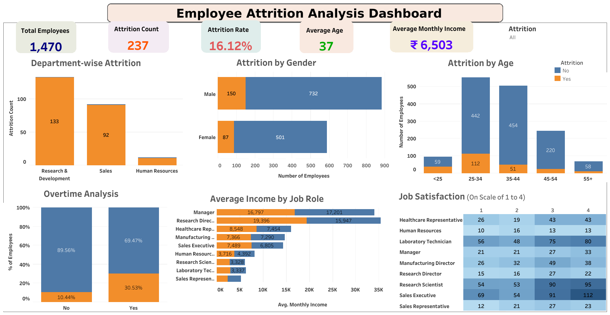

# 📊 Employee Attrition Analysis using Tableau



## 📌 Project Overview

This project presents an interactive **Employee Attrition Analysis Dashboard** built using **Tableau Public**. The dashboard analyzes workforce attrition using the IBM HR Analytics Employee Attrition dataset and provides actionable insights into employee turnover patterns across departments, gender, age groups, overtime, income, and job satisfaction.

The dashboard is designed to help HR professionals and business stakeholders identify key drivers of attrition and support data-driven workforce planning.

---

## 🎯 Business Problem

Employee attrition can lead to increased recruitment costs, reduced productivity, and loss of organizational knowledge. Understanding why employees leave is essential for improving retention strategies.

This dashboard helps answer questions such as:

- Which department experiences the highest attrition?
- Which age group has the highest employee turnover?
- Does overtime influence attrition?
- How does attrition vary by gender?
- Which job roles receive the highest average income?
- How satisfied are employees across different job roles?

---

## 📊 Dashboard KPIs

| KPI | Value |
|------|------:|
| Total Employees | 1,470 |
| Attrition Count | 237 |
| Attrition Rate | 16.12% |
| Average Age | 37 Years |
| Average Monthly Income | ₹6,503 |

---

## 📈 Dashboard Visualizations

### 📌 Department-wise Attrition
Analyzes employee attrition across departments to identify areas with the highest turnover.

### 📌 Attrition by Gender
Compares attrition between male and female employees using a stacked horizontal bar chart.

### 📌 Attrition by Age
Shows employee distribution across different age groups while highlighting employees who stayed versus employees who left.

### 📌 Overtime Analysis
Compares attrition rates between employees who work overtime and those who do not using a 100% stacked bar chart.

### 📌 Average Income by Job Role
Displays the average monthly income across various job roles.

### 📌 Job Satisfaction Heatmap
Visualizes employee distribution by job role and job satisfaction level to identify satisfaction trends.

### 📌 Interactive Filter
Includes an Attrition filter that dynamically updates all dashboard visualizations.

---

## 💡 Key Insights

- Research & Development has the highest employee attrition.
- Employees aged **25–34** account for the largest number of attrition cases.
- Employees working overtime have a noticeably higher attrition rate than employees who do not.
- Male employees have a higher attrition count than female employees.
- Managerial roles generally receive the highest average monthly income.
- Job satisfaction varies significantly across different job roles.

---

## 🛠️ Tools & Technologies

- Tableau Public
- IBM HR Analytics Employee Attrition Dataset
- Calculated Fields
- Level of Detail (LOD) Expressions
- Dashboard Actions
- Interactive Filters
- Data Visualization
- Business Intelligence

---

## 🖼️ Dashboard Preview


---

## 📂 Dataset

**Source:** IBM HR Analytics Employee Attrition Dataset

The dataset contains employee demographics, job information, compensation, work environment, satisfaction metrics, and attrition status for workforce analytics.

---

## 🚀 Skills Demonstrated

- HR Analytics
- Dashboard Design
- Interactive Data Visualization
- KPI Development
- Data Storytelling
- Business Intelligence
- Tableau Calculated Fields
- Level of Detail (LOD) Expressions
- Data Analysis

---

## 📁 Repository Structure

```text
Employee-Attrition-Analysis-Tableau/
│
├── Dashboard.png
├── Employee_Attrition_Analysis.twbx
├── WA_Fn-UseC_-HR-Employee-Attrition.csv
└── README.md
```

---

## 🔗 Tableau Public Dashboard

>https://public.tableau.com/views/Tableau-HR-Analytics-Dashboardc/Dashboard1?:language=en-US&:sid=&:redirect=auth&:display_count=n&:origin=viz_share_link

---

## 👤 Author

**Bhavesh Singh Yadav**

If you found this project helpful or interesting, feel free to ⭐ star this repository and explore my other data analytics projects.
